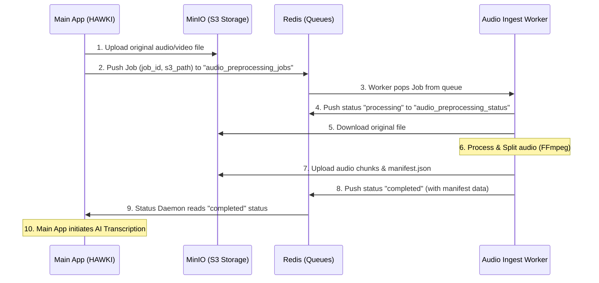

# Audio Ingest Worker

The `audio-ingest` service is a Python-based worker application that handles asynchronous audio preprocessing and chunking. It pulls jobs from a Redis queue, downloads the source audio from an S3-compatible storage (like MinIO), processes it using `ffmpeg` to split it into manageable chunks, and uploads the resulting chunks and manifest data back to the storage. Finally, it pushes status updates to a Redis status queue so the main application (e.g., HAWKI) can track the progress.

## Architecture Overview
- **Worker Environment**: Python 3.11 with `ffmpeg`
- **Message Broker**: Redis (Job-Queue & Status-Queue)
- **Object Storage**: MinIO (S3-compatible API)

## Prerequisites
- [Docker](https://docs.docker.com/get-docker/)
- [Docker Compose](https://docs.docker.com/compose/install/)

## Data Flow

The following sequence diagram illustrates how the `audio-ingest` worker interacts with the main application (e.g., HAWKI), Redis, and MinIO during the transcription pipeline:



---

## Deployment (via Docker Compose)

The recommended and easiest way to deploy the service is using Docker Compose. The provided `docker-compose.yml` spins up the Python worker, a Redis instance, and a MinIO server automatically, including the necessary bucket initialization.

### 1. Setup Environment
Clone the repository and prepare your environment variables:

```bash
git clone <repository-url>
cd audio-ingest

# Copy the example environment file
cp .env.example .env
```

### 2. Start the Services
Run the following command to pull the pre-built Docker image and start all containers in the background:

```bash
docker-compose up -d
```

**This command starts the following services:**
- **`redis`**: Running on port `6379`.
- **`minio`**: Running on port `9000` (S3 API) and `9001` (Web Console).
- **`minio-init`**: A short-lived container that configures MinIO, creates the `audio-ingest` bucket, and sets public access policies.
- **`audio-ingest`**: The Python worker listening for new jobs.

### 3. Verify the Deployment
Check the logs of the worker to ensure it successfully connected to Redis and MinIO, and is actively waiting for jobs:

```bash
docker-compose logs -f audio-ingest
```

---

## Environment Variables Configuration

The worker is highly configurable via environment variables. If you deploy the worker against external Redis or S3 instances (like AWS S3 or a managed Redis cluster), adjust these variables in your `.env` or deployment configuration:

| Variable | Description | Default (in `docker-compose.yml`) |
| --- | --- | --- |
| `REDIS_HOST` | Hostname of the Redis server | `redis` |
| `REDIS_PORT` | Port of the Redis server | `6379` |
| `REDIS_DB` | Redis Database index to use | `2` |
| `QUEUE_NAME` | The Redis list/queue for incoming jobs | `audio_preprocessing_jobs` |
| `STATUS_QUEUE` | The Redis list/queue for outgoing status updates | `audio_preprocessing_status` |
| `S3_ENDPOINT_URL`| Endpoint URL of your S3/MinIO server | `http://minio:9000` |
| `S3_ACCESS_KEY` | S3 Access Key ID | `minioadmin` |
| `S3_SECRET_KEY` | S3 Secret Access Key | `minioadmin` |
| `S3_REGION` | S3 Region | `us-east-1` |

---

## Local Development (Without Docker)

If you prefer to run the Python worker directly on your host machine for development or debugging purposes:

### 1. Install System Dependencies
The application requires `ffmpeg` to process audio files.
- **macOS:** `brew install ffmpeg`
- **Ubuntu/Debian:** `sudo apt-get install ffmpeg`

### 2. Set Up a Virtual Environment
```bash
python3 -m venv venv
source venv/bin/activate
```

### 3. Install Python Dependencies
```bash
pip install -r requirements.txt
```

### 4. Run the Worker
Ensure your `.env` file points to running instances of Redis and MinIO (for example, by pointing to `localhost:6379` and `http://localhost:9000` if you spin them up separately), then start the worker:
```bash
python worker.py
```